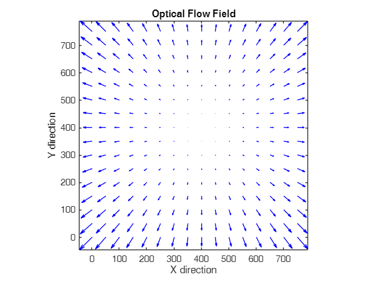
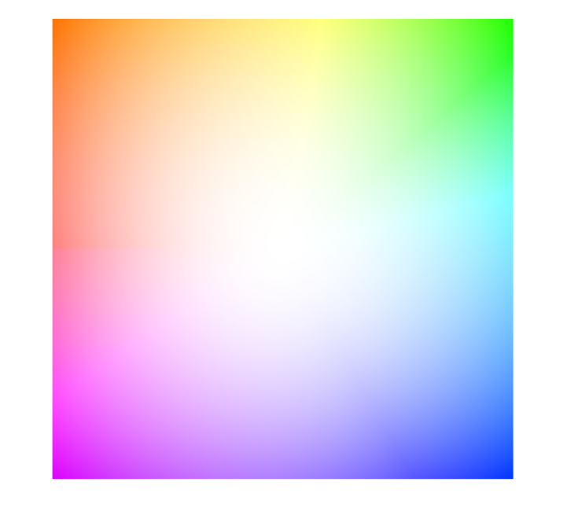
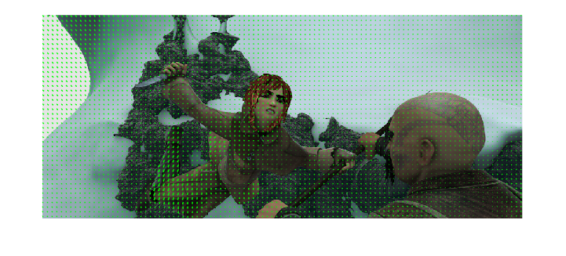
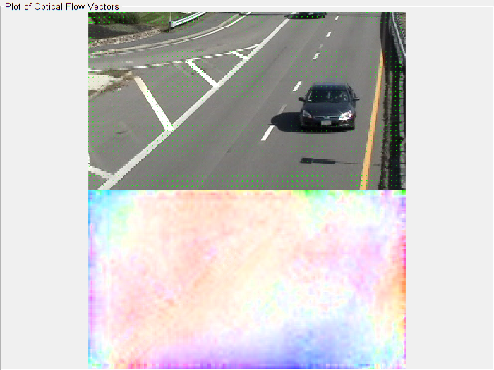
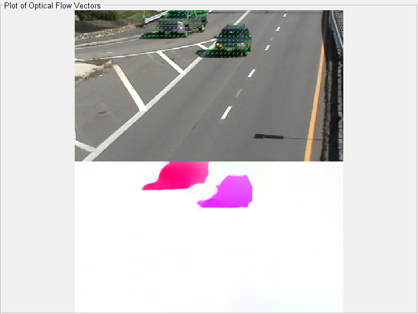

# OpticalFlow Visualization

## :eyes: Overview
[](https://ww2.mathworks.cn/matlabcentral/fileexchange/175668-opticalflow-visualization)
[](https://matlab.mathworks.com/open/github/v1?repo=cuixing158/OpticalFlow-Visualization&file=Examples.mlx)
[](https://raw.githubusercontent.com/cuixing158/OpticalFlow-Visualization/refs/heads/main/README_media/sponsors.jpg)

This repo implements the visualization of optical flow color images. It adds a object\-function [`flow2rgb`](./flow2rgb.m) for dense optical flow visualization to the built\-in object [`opticalFlow`](https://ww2.mathworks.cn/help/vision/ref/opticalflowobject.html). Compared to the existing [open\-source Python version](https://github.com/tomrunia/OpticalFlow_Visualization/tree/master), the code is more concise and intuitive, with the core implementation being only 10 lines!

## :clipboard: Requirements

- MATLAB R2015a or later
- Computer Vision Toolbox™

>[!NOTE]
> If you use [`opticalFlowRAFT`](https://ww2.mathworks.cn/help/vision/ref/opticalflowraft.html) from Example 2/3 for optical flow computation, then you will need R2024b or later versions.

## :scroll: Syntax

```matlab
flowImage = flow2rgb(flow);
```
## :inbox_tray: Input Arguments

flow: Object containing optical flow matrices,opticalFlow object

Object containing optical flow velocity matrices, specified as an [opticalFlow](https://ww2.mathworks.cn/help/vision/ref/opticalflowobject.html) object.
    
## :notebook: Example1

<details>
<summary> Example1 code collapse</summary>
    
Use opticalFlow to generate an 800x800x2 optical flow image, where the Vx and Vy directions point from the center of the image to the edges, and the magnitude increases gradually.

```matlab
% initialize optical flow image size
width = 800;  
height = 800;  

% create meshgrid  
[x, y] = meshgrid(1:width, 1:height);  

% image center  
centerX = width / 2;  
centerY = height / 2;  

% calculate Vx,Vy
Vx = (x - centerX) .* sqrt((x - centerX).^2 + (y - centerY).^2) ./ (width/2); 
Vy = (y - centerY) .* sqrt((x - centerX).^2 + (y - centerY).^2) ./ (height/2);

% construct optical flow object
flow = opticalFlow(Vx,Vy);  

% plot optical flow
figure;  
plot(flow,DecimationFactor=[50 50])
axis equal tight;  
title('Optical Flow Field');  
xlabel('X direction');  
ylabel('Y direction');
```



```matlab

% show dense optical flow
flowImage = flow2rgb(flow);
figure;imshow(flowImage)
```



</details>
    
##  :notebook: Example2: two adjacent images optical flow

<details>
<summary>Example2: two adjacent images optical flow</summary>
    
```matlab
img1_path = "images/frame_0006.png";
img2_path = "images/frame_0007.png";

% img1_path = "images/000038_10.png";
% img2_path = "images/000038_11.png";
% 
% img1_path = "images/img_050.jpg";
% img2_path = "images/img_050.jpg";

frame1 = imread(img1_path);
frame2 = imread(img2_path);

flowModel = opticalFlowRAFT; % introduced in R2024b
estimateFlow(flowModel,frame1);
flow = estimateFlow(flowModel,frame2);
reset(flowModel)
```

## :eyes: visualization

```matlab
figure;imshow(frame1)
hold on
plot(flow,DecimationFactor=[10 10],ScaleFactor=0.45,color="g");
```



```matlab

flowImage = flow2rgb(flow);
figure;imshow(flowImage)
```


</details>
 
##  :notebook: Example3: video optical flow

<details>
<summary>Example3: video optical flow</summary>
   
use same example as [https://ww2.mathworks.cn/help/vision/ref/opticalflowraft.html?s\_tid=doc\_ta\#mw\_d94e3efa\-966f\-4df7\-a731\-87dabf2be68e](https://ww2.mathworks.cn/help/vision/ref/opticalflowraft.html?s_tid=doc_ta#mw_d94e3efa-966f-4df7-a731-87dabf2be68e)

```matlab
flowModel = opticalFlowRAFT; % introduced in R2024b
vidReader = VideoReader("visiontraffic.avi",CurrentTime=11);
h = figure;
movegui(h);
hViewPanel = uipanel(h, Position=[0 0 1 1], Title="Plot of Optical Flow Vectors");
hPlot = axes(hViewPanel,Position=[0,0.5,1,0.5]);
dPlot = axes(hViewPanel,Position=[0,0,1,0.5]);
while hasFrame(vidReader)
    frame = readFrame(vidReader);
    flow = estimateFlow(flowModel,frame);

    imshow(frame,Parent=hPlot)
    hold(hPlot,"on")
    plot(flow,DecimationFactor=[10 10],ScaleFactor=0.45,Parent=hPlot,color="g");
    hold(hPlot,"off")

    flowImage = flow2rgb(flow);
    imshow(flowImage,Parent=dPlot)
    pause(10^-3)
end
```





```matlab
reset(flowModel)

```
</details>

# :books: References

1. S. Baker, D. Scharstein, J. Lewis, S. Roth, M. J. Black, and R. Szeliski.A database and evaluation methodology for optical flow.In Proc. IEEE International Conference on Computer Vision (ICCV), 2007.
1. [tomrunia/OpticalFlow\_Visualization: Python optical flow visualization following Baker et al. (ICCV 2007) as used by the MPI\-Sintel challenge](https://github.com/tomrunia/OpticalFlow_Visualization)
1. [https://github.com/weihuang527/optical\-flow](https://github.com/weihuang527/optical-flow)
1. [https://github.com/ltkong218/FastFlowNet](https://github.com/ltkong218/FastFlowNet)
